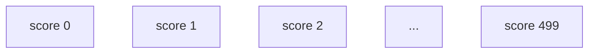

<!--  -->

# Python進階語法介紹

章士祺

---

## 串列（List）

- 串列（又稱為「清單」或「列表」），與其他語言的「陣列 (Array)」相同，其功能與變數相類似，是提供儲存資料的記憶體空間。

```mermaid
graph TD
    A[score 0]
    B[score 1]
    C[score 2]
    D[...]
    E[score 499]
```

## 串列宣告

- 一維串列宣告
- 空串列
- 多維串列宣告

---
