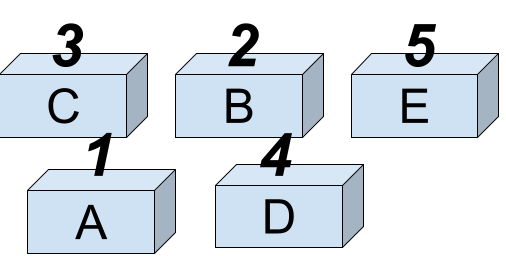

# Python</br>進階語法介紹

章士祺

---

## 串列（List）

串列（又稱為「清單」或「列表」），與其他語言的「陣列（Array）」相同，其功能與變數相類似，是提供儲存資料的記憶體空間。


---

## 串列宣告

### 一維串列宣告

一維串列的宣告方式是將元素置於中括號 ([]) 中，每個元素之間以逗號分隔，語法為：`串列名稱=[元素1,元素2,…]`

例如：宣告 `score` 串列，其元素內容為 `[1, 2, 3, 4, 5]`。


---

串列中各個元素資料型態可以相同，也可以不同，例如：

```python
list1=[1, 2, 3, 4, 5]
list2=["香蕉", "蘋果", "橘子"]
list3=[1, "香蕉", True]
```

---

### 空串列宣告

例如：`list4=[]`

### 多維串列宣告

例如以下是二維串列範例：

```python
list5=[["joe","1234"], ["mary","3368"], ["david","abcd"]]
print(list5[1])
print(list5[1][1])
```

---

## 讀取串列元素

語法：`串列名稱[索引]`

例如：

```python
list1 = [1, 2, 3, 4]
print(list1[0])
```

---

索引值是從 0 開始計數。索引值不可超出串列的範圍，否則執行時會產生「list index out of range」錯誤。例如：

```python
list4 = ["香蕉", "蘋果", "橘子"]
print(list4[3]) # IndexError: list index out of range
```

索引值可以是負值，表示由串列的最後向前取出， 「-1」表示最後一個元素，「-2」表示倒數第二個元素。同理，負數索引值不可超出串列的範圍，否則執行時會產生錯誤。例如：

```python
list4 = ["香蕉", "蘋果", "橘子"]
print(list4[-4]) # IndexError: list index out of range
```

[01_list1.py](/sample_codes/part2/01_list1.py)

---

## 改變串列元素改變串列元素

語法為：串列名稱[索引]=元素內容

例如：

```python
list1=[1, 2, 3, 4, 5]
print(list1[0])
list1[0] = 9
print(list1[0])
```

---

## 使用 for in 讀取串列

語法：

```python
for 變數 in 串列:
    程式區塊
```

例如：

```python
list1 = ["香蕉", "蘋果", "橘子"]
for s in list1:
    print(s)
```

[01_list2.py](/sample_codes/part2/02_list2.py)

---

## 使用 for in range 讀取串列

取得串列長度：

迴圈中 range() 函式的範圍通常會利用 len() 函式計算串列的長度。例如：計算 scores 串列的長度，顯示結果為 3。

```python
scores=[83, 98, 56]
print(len(scores)) # 3
```

以 for in range 讀取串列：

```python
scores=[83, 98, 56]
for i in range(len(scores)):
    print(scores[i])
```

[03_list3.py](/sample_codes/part2/03_list3.py)

---

## index() 搜尋

語法：`索引值=串列名稱.index(串列元素)`

例如：

```python
list1 = ["香蕉", "蘋果", "橘子"]
n = list1.index("蘋果")
print(n)
m = list1.index("西瓜") # ValueError: '西瓜' is not in list
```

---

## count() 計算次數

語法：`次數=串列名稱. count(串列元素)`

例如：

```python
list1 = ["香蕉", "蘋果", "橘子"]
n = list1.count("蘋果")
m = list1.count("西瓜")
```

---

## 增加串列元素

### append()方法
  
語法： `串列名稱.append(元素值)`

例如： 在 list1 串列最後面增加一個串列元素「豬頭」。

```python
list1 = [1, 2, 3, 4, 5, 6]
list1.append("豬頭")
print(list1)
```

---

### insert()方法
  
語法： `串列名稱.insert(索引值,串列元素)`

例如：在 list1 串列索引 3 的位置插入一個串列元素「豬頭」。

```python
list1 = [1, 2, 3, 4, 5, 6]
list1.insert(3, "豬頭")
print(list1)
```

---

如果索引值大於或等於串列元素個數，將如同 append() 方法一樣將串列元素加在最後面。

索引值也可以是負值，表示由串列的最後向前推算，「-1」表示最後一個元素，「-2」表示倒數第二個元素，依此類推。

例如：在 list1 串列索引第 -1、12 的位置插入串列元素。

```python
list1 = [1, 2, 3, 4, 5, 6]
list1.insert(-1, "鳳梨蝦球")
print(list1)
list1.insert(12, "高麗菜")
print(list1)
```

[04_append.py](/sample_codes/part2/04_append.py)

---

## 刪除串列元素

### remvoe()方法

語法：`串列名稱.remove(串列元素)`

例如：刪除 list1 串列中「夏天」的串列元素。

```python
list1 =["春天", "夏天", "秋天", "冬天"]
list1.remove("夏天")
print(list1)
```

---

### pop()方法

語法：`串列名稱.pop(索引值)`

例如：

```python
list1 = [1, 2, 3, 4, 5, 6]
n = list1.pop()
print(list1, n)
n = list1.pop(2)
print(list1, n)
```

---

### del 刪除串列元素

刪除串列單一元素語法：`del 串列名稱(n1)`

刪除串列指定範圍元素的語法：`del 串列名稱(n1:n2[:n3])`

例如：

```python
list1 = [1, 2, 3, 4, 5, 6]
del list1[1]
print(list1)
list2 = [1, 2, 3, 4, 5, 6]
del list2[1:5:2]
print(list2)
```

[05_remove.py](/sample_codes/part2/05_remove.py)

---

## sort() 由小到大排序

語法：`串列名稱.sort()`

例如：將 list1 串列由小到大排序。

```python
list1 = [3, 2, 1, 5]
list1.sort()
print(list1)
```

---

## reverse() 反轉串列順序

語法：`串列名稱.reverse()`

例如：將 list1 串列順序反轉。

```python
list1 = [3, 2, 1, 5]
list1.reverse()
print(list1)
```

---

## 由大到小排序

語法：

`串列名稱.sort()`

`串列名稱.reverse()`

例如：

```python
list1 = [3, 2, 1, 5]
list1.sort()
print(list1)
list1.reverse()
print(list1)
```

---

## sorted() 排序

語法：`串列名稱2=sorted(串列名稱1, reverse=True)`

例如：將 list1 串列由大到小排序，並儲存在 list2 串列。

```python
list1 = [3, 2, 1, 5]
list2=sorted(list1, reverse=True)
print(list2)
print(list1)
```

[06_sorted.py](/sample_codes/part2/06_sorted.py)

---

## 串列常用方法列表

下表串列常用方法：`list1=[1,2,3,4,5,6]`

| 方法                  | 說明          | 範例                 | 結果              |
|---------------------|-------------|--------------------|-----------------|
| list1[n1:n2]        | 取出n1到n2-1元素 | list2=list1[1:4]   | list2=[2,3,4]   |
| list1[n1:n2:n3]     | 同上，取出間隔為n3  | list2=list1[1:4:2] | list2=[2,4]     |
| del list1[n1:n2]    | 刪除n1到n2-1元素 | del list1[1:4]     | list1=[1,5,6]   |
| del list1[n1:n2:n3] | 同上，刪除間隔為n3  | del list1[1:4:2]   | list1=[1,3,5,6] |
| n=len(list1)        | 取得串列元素數目    | n=len(list1)       | n=6             |
| n=min(list1)        | 取得元素最小值     | n=min(list1)       | n=1             |
| n=max(list1)        | 取得元素最大值     | n=max(list1)       | n=6             |
| n=list1.index(n1)   | 第1次n1元素的索引值 | n=list1.index(3)   | n=2             |
| n=list1.count(n1)   | n1元素出現的次數   | n=list1.count(3)   | n=1             |

---

| 方法               | 說明                | 範例                 | 結果                     |
|------------------|-------------------|--------------------|------------------------|
| list1.append(n1) | 將n1元素加在串列最後       | list1.append(8)    | list1=[1,2,3,4,5,6,8]  |
| list1[n1:n2:n3]  | 同上，取出間隔為n3        | list2=list1[1:4:2] | list2=[2,4]            |
| n=list1.pop()    | 取出最後1個元素並由串列中移除元素 | n=list1.pop()      | n=6, list1=[1,2,3,4,5] |
| list1.remove(n1) | 移除第1次的n1元素        | list1.remove(3)    | list1=[1,2,4,5,6]      |
| list1.reverse()  | 反轉串列順序            | list1.reverse()    | list1=[6,5,4,3,2,1]    |
| list1.sort()     | 將串列由小到大排序         | list1.sort()       | list1=[1,2,3,4,5,6]    |

---

## 元組（Tuple）

建立元組，使用小括號

語法：`元組名稱=(元素1,元素2, ...)`

例如：

```python
tuple1 = (1, 2, 3, 4, 5)
tuple2 = (1, "紅豆", True)
```

元組的使用方式與串列相同，但不能修改元素值，否則會產生錯誤

```python
tuple3 = ("綠豆", "紅豆", "花生")
tuple3[1]="黃豆" # TypeError: 'tuple' object does not support item assignment
```

---

## 串列和元組互相轉換

Python 提供list命令將元組轉換為串列，tuple命令將串列轉換為元組。

元組轉串列範例：

```python
tuple1=(1,2,3,4,5)
list1=list(tuple1)
list1.append(8)
```

串列轉元組範例：

```python
list2=[1,2,3,4,5]
tuple2=tuple(list2)
tuple2.append(8)
```

---

## 練習題 1

輸入一個整數N，再以迴圈方式輸入N個數字，並將這些數字存入串列中。

輸入一個整數N，將N項的費氏數列存到串列中。

> 所謂費波那契數列，是指在一串數字中，每一項是前兩項的和。數學上的定義為：第 0 項 = 0、第 1 項 = 1、第 n 項 = 第 n-1 項 + 第 n-2 項。從上面的數學定義，我們可以簡單列出數列的 0 到 10 項為：0, 1, 1, 2, 3, 5, 8, 13, 21, 34, 55。

---

## 字典基本操作

### 建立字典

- 字典的結構，其元素是以「鍵 - 值」對方式儲存，這樣就可使用「鍵」來取得「值」。
- 有多種方式可以建立字典，第一種方式為將元素置於一對大括號「{}」中，其語法為：字典名稱={鍵1:值1,鍵2:值2,…}
- 字串、整數、浮點數等皆可做為「鍵」，但以字串做為「鍵」的情況最多。

---

### 字典取值

字典，與串列最大的不同在於串列元素在記憶體中是依序排列，而字典元素則是隨意放置，沒有一定順序。


基本取值方式

語法為：`字典名稱[鍵]`

---

### 當字典的鍵重複時

字典是使用「鍵」做為索引來取得「值」，所以「鍵」必須是唯一，而「值」可以重覆。

如果「鍵」重覆的話，則前面的「鍵」會被覆蓋，只有最後的「鍵」有效，例如：

```python
dict2={"香蕉":20, "蘋果":50, "橘子":30, "香蕉":25}
print(dict2)
```

---

### 當字典的鍵不存在時

若輸入的「鍵」不存在會產生錯誤，因此 Python 另外提供了 get 方法可以取得字典元素值，即使「鍵」不存在也不會產生錯誤，語法為：`字典名稱.get(鍵[預設值])`

| 預設值狀況   | 鍵是否存在        | 返回值                |
|---------|--------------|--------------------|
| 沒有傳入預設值 | 鍵存在</br>鍵不存在 | 返回鍵對應的值</br>返回None |
| 有傳入預設值  | 鍵存在</br>鍵不存在 | 返回鍵對應的值</br>返回預設值  |

[07_dictget.py](/sample_codes/part2/07_dictget.py)