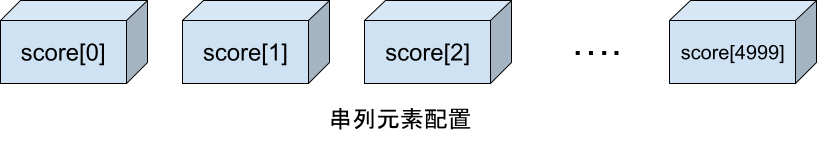
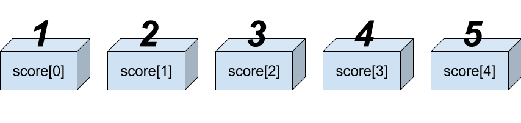

# Python</br>進階語法介紹

章士祺

---

## 串列（List）

串列（又稱為「清單」或「列表」），與其他語言的「陣列（Array）」相同，其功能與變數相類似，是提供儲存資料的記憶體空間。

</br></br>

---

## 串列宣告

### 一維串列宣告

一維串列的宣告方式是將元素置於中括號 ([]) 中，每個元素之間以逗號分隔，語法為：`串列名稱=[元素1,元素2,…]`

例如：宣告 `score` 串列，其元素內容為 `[1, 2, 3, 4, 5]`。


---

串列中各個元素資料型態可以相同，也可以不同，例如：

```python
list1=[1, 2, 3, 4, 5]
list2=["香蕉", "蘋果", "橘子"]
list3=[1, "香蕉", True]
```

---

### 空串列宣告

例如：`list4=[]`

### 多維串列宣告

例如以下是二維串列範例：

```python
list5=[["joe","1234"], ["mary","3368"], ["david","abcd"]]
print(list5[1])
print(list5[1][1])
```

---

## 讀取串列元素

語法：`串列名稱[索引]`

例如：

```python
list1 = [1, 2, 3, 4]
print(list1[0])
```

---

索引值是從 0 開始計數。索引值不可超出串列的範圍，否則執行時會產生「list index out of range」錯誤。例如：

```python
list4 = ["香蕉", "蘋果", "橘子"]
print(list4[3]) # IndexError: list index out of range
```

索引值可以是負值，表示由串列的最後向前取出， 「-1」表示最後一個元素，「-2」表示倒數第二個元素。同理，負數索引值不可超出串列的範圍，否則執行時會產生錯誤。例如：

```python
list4 = ["香蕉", "蘋果", "橘子"]
print(list4[-4]) # IndexError: list index out of range
```

[01_list1.py](https://github.com/scchang2023/linkou_community/tree/main/sample_codes/part2/01_list1.py)

---

## 改變串列元素改變串列元素

語法為：串列名稱[索引]=元素內容

例如：

```python
list1=[1, 2, 3, 4, 5]
print(list1[0])
list1[0] = 9
print(list1[0])
```

---

## 使用 for in 讀取串列

語法：

```python
for 變數 in 串列:
    程式區塊
```

例如：

```python
list1 = ["香蕉", "蘋果", "橘子"]
for s in list1:
    print(s)
```

[01_list2.py](https://github.com/scchang2023/linkou_community/tree/main/sample_codes/part2/02_list2.py)

---

## 使用 for in range 讀取串列

取得串列長度：

迴圈中 range() 函式的範圍通常會利用 len() 函式計算串列的長度。例如：計算 scores 串列的長度，顯示結果為 3。

```python
scores=[83, 98, 56]
print(len(scores)) # 3
```

以 for in range 讀取串列：

```python
scores=[83, 98, 56]
for i in range(len(scores)):
    print(scores[i])
```

[03_list3.py](https://github.com/scchang2023/linkou_community/tree/main/sample_codes/part2/03_list3.py)

---

## index() 搜尋

語法：`索引值=串列名稱.index(串列元素)`

例如：

```python
list1 = ["香蕉", "蘋果", "橘子"]
n = list1.index("蘋果")
print(n)
m = list1.index("西瓜") # ValueError: '西瓜' is not in list
```

---

## count() 計算次數

語法：`次數=串列名稱. count(串列元素)`

例如：

```python
list1 = ["香蕉", "蘋果", "橘子"]
n = list1.count("蘋果")
m = list1.count("西瓜")
```

---

## 增加串列元素

### append()方法
  
語法： `串列名稱.append(元素值)`

例如： 在 list1 串列最後面增加一個串列元素「豬頭」。

```python
list1 = [1, 2, 3, 4, 5, 6]
list1.append("豬頭")
print(list1)
```

---

### insert()方法
  
語法： `串列名稱.insert(索引值,串列元素)`

例如：在 list1 串列索引 3 的位置插入一個串列元素「豬頭」。

```python
list1 = [1, 2, 3, 4, 5, 6]
list1.insert(3, "豬頭")
print(list1)
```

---

如果索引值大於或等於串列元素個數，將如同 append() 方法一樣將串列元素加在最後面。

索引值也可以是負值，表示由串列的最後向前推算，「-1」表示最後一個元素，「-2」表示倒數第二個元素，依此類推。

例如：在 list1 串列索引第 -1、12 的位置插入串列元素。

```python
list1 = [1, 2, 3, 4, 5, 6]
list1.insert(-1, "鳳梨蝦球")
print(list1)
list1.insert(12, "高麗菜")
print(list1)
```

[04_append.py](sample_codes/part2/04_append.py)

---

## 刪除串列元素

---